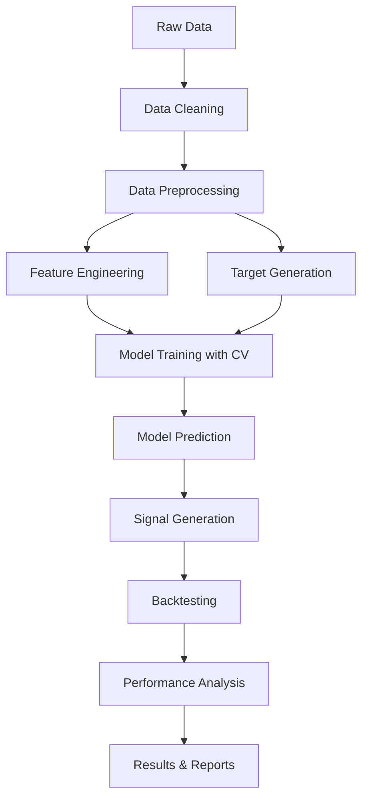

# 🚀 cqAI - 现代化量化交易AI研究项目

## 📋 项目概述

**cqAI (Crypto Quantitative AI)** - 基于现有的加密货币交易分析代码基础，构建一个现代化的、融合统计模型和AI模型的量化交易研究平台。

**核心目标**: 数据 → 特征工程 → 目标变量 → 模型训练 → 交叉验证 → 信号生成 → 回测分析

---

## 🏗️ 项目架构

### 📁 建议的项目结构

```
📁 cqAI/                            # cqAI项目根目录
├── 📁 data/                         # 数据层
│   ├── raw/                         # 原始数据 (现有的btc_csv/)
│   ├── processed/                   # 预处理后数据
│   └── features/                    # 特征工程输出
├── 📁 src/
│   ├── data/                        # 数据管道
│   │   ├── loader.py               # 数据加载器 (升级现有data_handler.py)
│   │   ├── cleaner.py              # 数据清洗
│   │   └── preprocessor.py         # 预处理器
│   ├── features/                    # 特征工程 (升级现有indicators/)
│   │   ├── technical.py            # 技术指标 (保留现有)
│   │   ├── statistical.py          # 统计特征
│   │   ├── market_microstructure.py # 微观结构特征
│   │   └── feature_engineer.py     # 特征工程主类
│   ├── targets/                     # 目标变量生成
│   │   ├── returns.py              # 收益率目标
│   │   ├── volatility.py           # 波动率目标
│   │   └── direction.py            # 方向性目标
│   ├── models/                      # 模型层
│   │   ├── statistical/            # 统计模型
│   │   ├── ml/                     # 机器学习模型
│   │   ├── ensemble/               # 集成模型
│   │   └── model_factory.py        # 模型工厂
│   ├── validation/                  # 交叉验证
│   │   ├── time_series_cv.py       # 时间序列CV
│   │   ├── walk_forward.py         # 滚动窗口验证
│   │   └── purged_cv.py            # 去污染CV
│   ├── signals/                     # 信号生成 (升级现有factor_signal.py)
│   │   ├── signal_generator.py     # 信号生成器
│   │   └── signal_transformer.py   # 信号转换器
│   ├── backtesting/                 # 回测引擎 (升级现有simulation/)
│   │   ├── portfolio.py            # 组合管理
│   │   ├── execution.py            # 执行模拟
│   │   └── backtest_engine.py      # 回测引擎
│   ├── evaluation/                  # 结果分析 (升级现有utils/)
│   │   ├── metrics.py              # 性能指标
│   │   ├── risk_analysis.py        # 风险分析
│   │   └── visualization.py        # 可视化
│   └── config/                      # 配置管理 (保留现有)
├── 📄 cqai_main.py                  # cqAI主程序入口
├── 📄 requirements.txt              # 依赖管理
├── 📄 cqai_config.yaml             # cqAI配置文件
└── 📄 cqAI_PROJECT_PLAN.md         # 项目计划文档
```

---

## 🔄 核心工作流程



---

## ✅ 详细实施计划

### 🎯 Phase 1: 数据管道建设
**优先级**: 🔴 高 | **预估时间**: 1-2周

#### 1.1 数据加载系统
- [ ] **升级 DataHandler → DataLoader**
  - 支持多种数据格式 (CSV, Parquet, HDF5)
  - 增量数据加载功能
  - 内存优化和批量处理
  - 数据版本管理

#### 1.2 数据清洗系统
- [ ] **创建 DataCleaner**
  - 异常值检测和处理 (IQR, Z-score, Isolation Forest)
  - 缺失值处理策略 (前向填充, 插值, 删除)
  - 数据一致性检查
  - 时间序列完整性验证

#### 1.3 数据预处理系统
- [ ] **创建 DataPreprocessor**
  - 数据标准化和归一化
  - 时间对齐和重采样
  - 数据分割 (训练/验证/测试)
  - 特征缩放和编码

---

### 🎯 Phase 2: 特征工程系统
**优先级**: 🔴 高 | **预估时间**: 2-3周

#### 2.1 技术指标升级
- [ ] **基于现有 fast_SMA, fast_std 等函数**
  - 扩展技术指标库 (RSI, MACD, Bollinger Bands)
  - 多时间框架指标
  - 自适应参数指标
  - 指标组合和衍生

#### 2.2 统计特征
- [ ] **创建 StatisticalFeatures**
  - 滚动统计量 (均值, 方差, 偏度, 峰度)
  - 分布特征 (分位数, 众数)
  - 相关性特征 (自相关, 互相关)
  - 趋势和季节性特征

#### 2.3 市场微观结构特征
- [ ] **创建 MarketMicrostructureFeatures**
  - 价差分析 (bid-ask spread)
  - 流动性指标
  - 订单流特征
  - 波动率聚类

#### 2.4 特征工程管道
- [ ] **创建 FeatureEngineer**
  - 自动化特征生成
  - 特征选择算法
  - 特征重要性评估
  - 特征交互项生成

---

### 🎯 Phase 3: 目标变量设计
**优先级**: 🔴 高 | **预估时间**: 1-2周

#### 3.1 收益率目标
- [ ] **创建 ReturnTargets**
  - 前瞻收益率 (1h, 4h, 1d, 1w)
  - 累积收益率
  - 风险调整收益率 (Sharpe, Sortino)
  - 分位数收益率

#### 3.2 波动率目标
- [ ] **创建 VolatilityTargets**
  - 实现波动率 (realized volatility)
  - GARCH模型预测
  - 波动率微笑特征
  - VIX类指标

#### 3.3 方向性目标
- [ ] **创建 DirectionTargets**
  - 涨跌分类 (binary, multi-class)
  - 趋势强度分类
  - 突破/回调模式
  - 支撑阻力位分析

---

### 🎯 Phase 4: 模型系统
**优先级**: 🟡 中高 | **预估时间**: 3-4周

#### 4.1 统计模型
- [ ] **实现 StatisticalModels**
  - 线性回归 (OLS, Ridge, Lasso, Elastic Net)
  - 时间序列模型 (ARIMA, SARIMA, VAR)
  - 状态空间模型 (Kalman Filter)
  - GARCH族模型

#### 4.2 机器学习模型
- [ ] **实现 MLModels**
  - 树模型 (Random Forest, Extra Trees)
  - 梯度提升 (XGBoost, LightGBM, CatBoost)
  - 神经网络 (MLP, LSTM, GRU)
  - 支持向量机 (SVM, SVR)

#### 4.3 集成模型
- [ ] **实现 EnsembleModels**
  - Stacking (多层集成)
  - Blending (加权平均)
  - Voting (投票机制)
  - Dynamic ensemble (动态权重)

#### 4.4 模型工厂
- [ ] **创建 ModelFactory**
  - 统一模型接口
  - 超参数管理
  - 模型注册和调用
  - 模型版本控制

---

### 🎯 Phase 5: 交叉验证系统
**优先级**: 🟡 中高 | **预估时间**: 2-3周

#### 5.1 时间序列交叉验证
- [ ] **实现 TimeSeriesCV**
  - 防止数据泄漏的CV策略
  - 滑动窗口验证
  - 扩展窗口验证
  - 嵌套交叉验证

#### 5.2 滚动窗口验证
- [ ] **实现 WalkForwardCV**
  - 模拟实际交易环境
  - 固定窗口 vs 扩展窗口
  - 重训练频率优化
  - 性能退化检测

#### 5.3 去污染交叉验证
- [ ] **实现 PurgedCV**
  - 处理数据重叠问题
  - 禁用期设置
  - 标签泄漏检测
  - 时间序列特异性处理

---

### 🎯 Phase 6: 信号生成系统
**优先级**: 🟡 中 | **预估时间**: 2周

#### 6.1 信号生成器升级
- [ ] **升级 SignalGenerator**
  - 支持ML模型预测输入
  - 概率到信号转换
  - 多模型信号融合
  - 信号强度量化

#### 6.2 信号转换器
- [ ] **创建 SignalTransformer**
  - 概率校准 (Platt scaling, Isotonic regression)
  - 信号平滑和去噪
  - 信号时间衰减
  - 多时间框架信号聚合

---

### 🎯 Phase 7: 回测系统
**优先级**: 🟡 中 | **预估时间**: 2-3周

#### 7.1 组合管理器
- [ ] **创建 PortfolioManager**
  - 资金管理策略
  - 仓位大小计算
  - 风险预算分配
  - 杠杆控制

#### 7.2 执行引擎
- [ ] **创建 ExecutionEngine**
  - 滑点模型
  - 交易成本计算
  - 执行延迟模拟
  - 流动性约束

#### 7.3 回测引擎升级
- [ ] **升级 BacktestEngine**
  - 支持ML信号输入
  - 事件驱动架构
  - 多资产组合回测
  - 实时回测模式

---

### 🎯 Phase 8: 结果分析系统
**优先级**: 🟢 中低 | **预估时间**: 2-3周

#### 8.1 性能指标
- [ ] **实现 PerformanceMetrics**
  - 经典指标 (Sharpe, Calmar, Sortino)
  - 信息比率和跟踪误差
  - 最大回撤分析
  - 胜率和盈亏比

#### 8.2 风险分析
- [ ] **实现 RiskAnalysis**
  - VaR和CVaR计算
  - 压力测试
  - 情景分析
  - 相关性分析

#### 8.3 可视化系统
- [ ] **创建 VisualizationSystem**
  - 交互式图表 (Plotly)
  - 策略表现仪表板
  - 风险报告生成
  - 模型解释性可视化

---

### 🎯 Phase 9: 系统集成
**优先级**: 🟢 低 | **预估时间**: 1-2周

#### 9.1 cqAI主程序管道
- [ ] **创建 cqAI_MainPipeline**
  - 端到端自动化流程
  - 参数化实验运行
  - 并行化处理
  - 错误处理和重试

#### 9.2 cqAI配置系统升级
- [ ] **升级cqAI配置系统**
  - cqai_config.yaml配置文件
  - 环境变量管理
  - 实验参数跟踪
  - 配置验证

#### 9.3 cqAI日志和监控
- [ ] **添加cqAI日志监控**
  - 结构化日志记录
  - 性能监控
  - 实验跟踪 (MLflow)
  - cqAI告警系统

---

## 🔧 技术栈升级

### 新增依赖包 (requirements.txt)

```python
# 现有核心包
pandas>=1.5.0
numpy>=1.21.0
matplotlib>=3.5.0
numba>=0.56.0
pyarrow>=10.0.0

# 机器学习
scikit-learn>=1.3.0
xgboost>=1.7.0
lightgbm>=3.3.0
catboost>=1.2.0

# 统计模型
statsmodels>=0.14.0
arch>=5.3.0  # GARCH模型

# 特征工程
tsfresh>=0.20.0  # 自动特征提取
ta>=0.10.0       # 技术分析库

# 深度学习 (可选)
torch>=1.13.0
tensorflow>=2.10.0

# 可视化
plotly>=5.0.0
seaborn>=0.12.0
dash>=2.0.0  # 交互式仪表板

# 实验管理
mlflow>=2.0.0
optuna>=3.0.0  # 超参数优化

# 数据处理
polars>=0.18.0  # 高性能数据处理 (可选)
dask>=2023.1.0  # 大数据处理 (可选)

# 配置和工具
pydantic>=1.10.0  # 数据验证
hydra-core>=1.3.0  # 配置管理
loguru>=0.7.0     # 日志记录
```

---

## 📊 项目里程碑

### 🎯 cqAI Milestone 1: 数据基础设施 (4周)
- ✅ cqAI数据管道完整搭建
- ✅ cqAI特征工程系统建立
- ✅ 目标变量设计完成

### 🎯 cqAI Milestone 2: AI模型和验证 (6周)
- ✅ 统计和ML模型实现
- ✅ cqAI交叉验证系统完成
- ✅ 初步模型评估

### 🎯 cqAI Milestone 3: 智能交易系统 (4周)
- ✅ cqAI信号生成系统
- ✅ 智能回测引擎完成
- ✅ cqAI性能分析系统

### 🎯 cqAI Milestone 4: 系统优化 (2周)
- ✅ cqAI端到端集成
- ✅ 性能优化
- ✅ 文档和测试

---

## 🚀 实施建议

### cqAI 立即开始 (Phase 1)
1. **保留现有优秀代码**: `fast_SMA`, `fast_std`, `SignalGenerator` 等
2. **升级cqAI数据处理**: 基于现有 `DataHandler` 扩展
3. **建立cqAI测试框架**: 确保代码质量

### cqAI 中期目标 (Phase 2-5)
1. **cqAI特征工程**: 利用现有技术指标基础
2. **cqAI模型系统**: 从简单到复杂逐步实现
3. **cqAI验证系统**: 确保模型可靠性

### cqAI 长期愿景 (Phase 6-9)
1. **cqAI生产级系统**: 稳定、高效、可扩展
2. **cqAI深度集成**: 深度学习和强化学习
3. **cqAI实盘交易**: 向实际交易系统演进

---

## 📝 cqAI更新日志

### v1.0 (2024-01-XX)
- cqAI初始项目计划创建
- 基于现有代码基础设计cqAI架构
- 详细任务分解和时间规划

### v1.1 (2024-01-XX)
- 项目重命名为 cqAI (Crypto Quantitative AI)
- 更新所有文件和文件夹命名规范
- 强化AI和量化交易的定位

### v1.2 (待更新)
- cqAI Phase 1 实施进度更新
- 架构调整和优化
- 新需求和功能添加

---

**项目名称**: cqAI (Crypto Quantitative AI)
**最后更新**: 2024年1月
**负责人**: [你的名字]
**项目状态**: 规划阶段 → 开发准备
